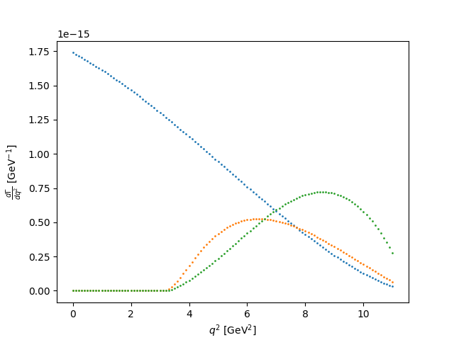
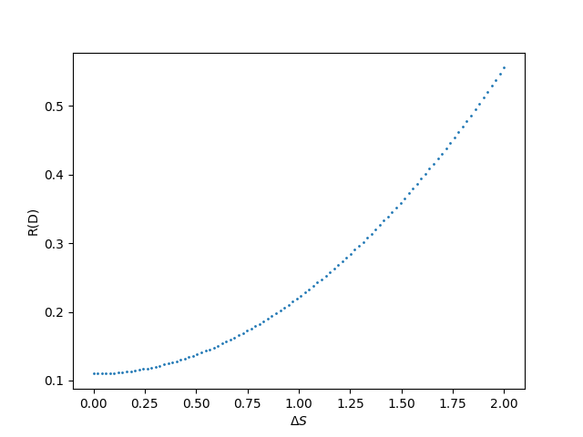
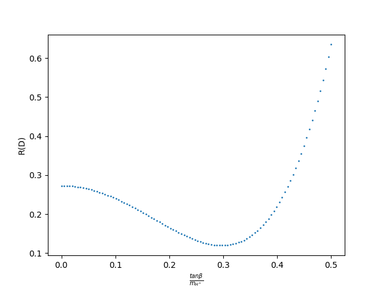

# semileptonicdecay
Study semileptonic B->Dlnu decays

Help with more run options: 
python semileptonicdecay.py -h  

To run:
Plot differential decay rate of B->Dlnu decays and R(D) for all cases: 
m_l=0 
m_l=m_tau 
m_l=m_tau with new physics 
python semileptonicdecay.py -p -prd  

        Dlnu"</img>
        
        </img>
        
        </img>

TODO: 
Get global constants via scraping 
Add legend to plots 
Write README
